# AWA 시퀀스 다이어그램

## 1. 로그인

로그인은 Email, Passwod 입력을 통해 DB를 확인하여 로그인 진행

### 1-1. 로그인 성공

### 1-2. 로그인 실패

### 1-3. 소셜 로그인

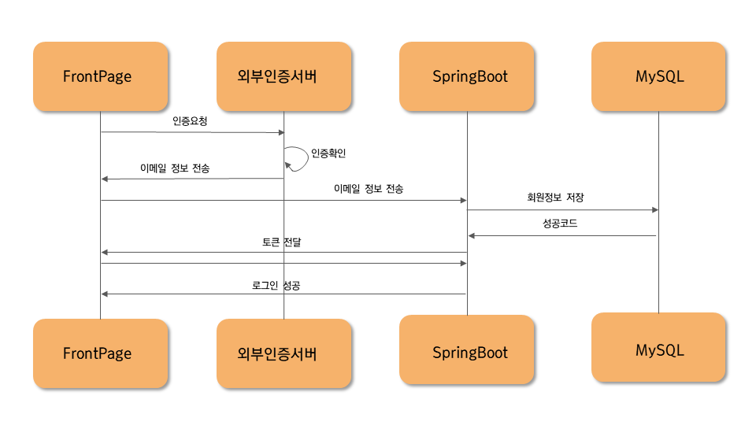

## 2. 회원 가입

### 2-1. 일반 회원가입

#### 2-1-1. 이메일 중복검사

#### 2-1-2. 닉네임 중복검사

#### 2-1-3. 회원가입 성공

## 3. 비밀번호 찾기 및 변경

## 4. 홈

홈화면에 입장했을 때, 피드에 보여줄 작품 정보를 불러온다.

## 5. 프로필

프로플 페이지에 입장하면 해당 유저에 맞는 프로필 정보를 불러온다.

### 5-1. 프로필 정보 요청

### 5-2. 선호분야 선택

### 5-3. 프로필 수정

### 5-4. 팔로우 요청

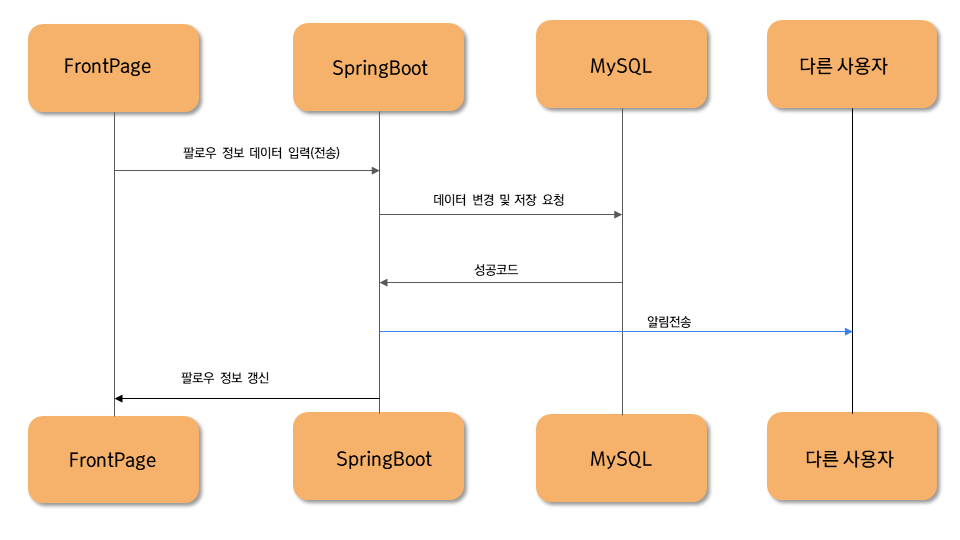

## 6. 옥션

### 6-1. 게시글 전체 조회

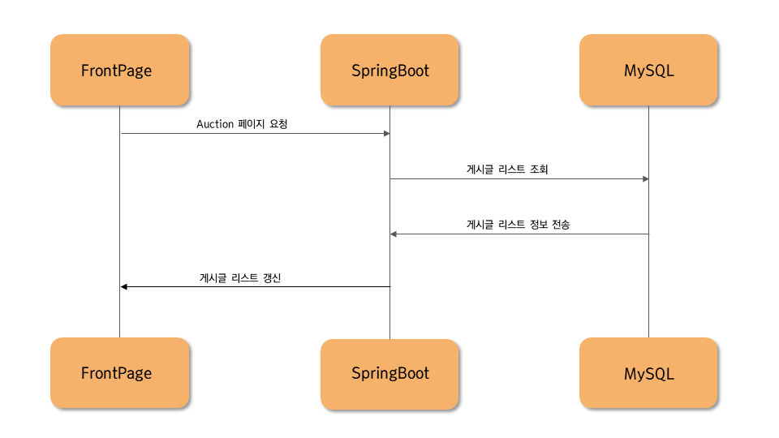

### 6-2. 게시글 개별 조회

#### 6-2-1. 게시글 개별 조회 - 좋아요 요청

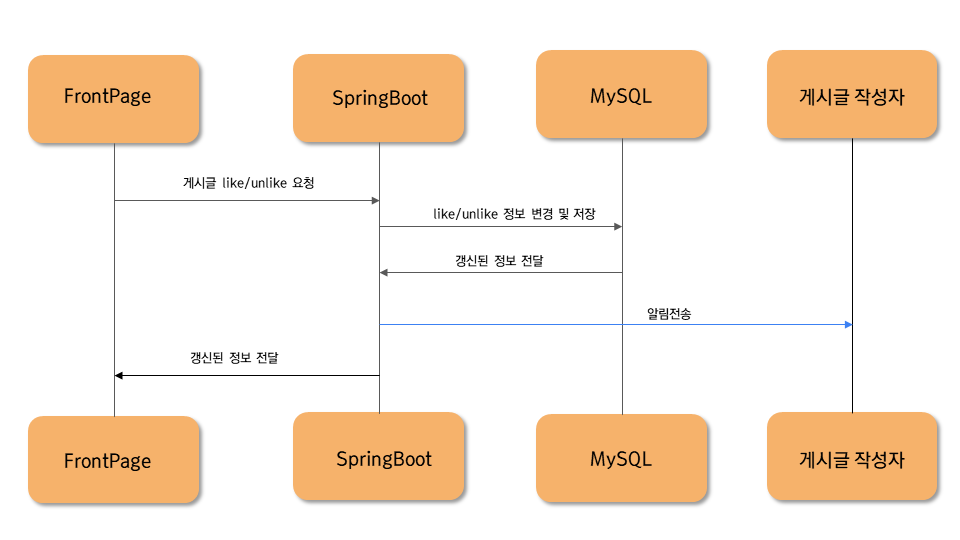

#### 6-2-2. 게시글 개별 조회 - 댓글 작성

#### 6-2-3. 게시글 개별 조회 - 댓글 조회/수정/삭제

### 6-3. 게시글 생성/수정

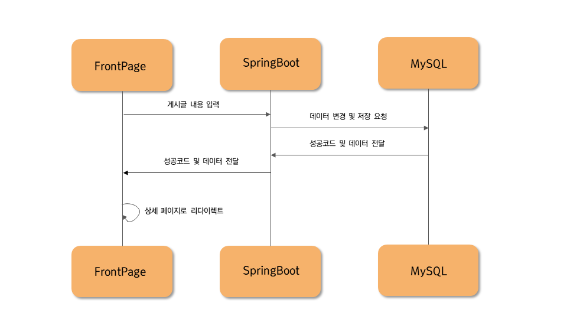

### 6-4. 게시글 삭제

### 6-5. 게시글 신고

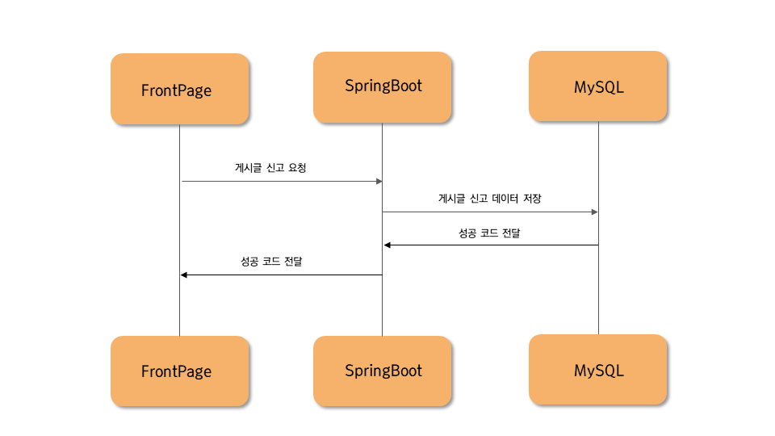

## 7. 공지사항

### 7-1. 공지사항 전체 조회

### 7-2. 공지사항 개별 조회

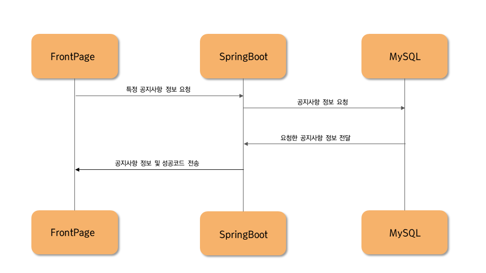

### 7-3. 공지사항 생성/수정

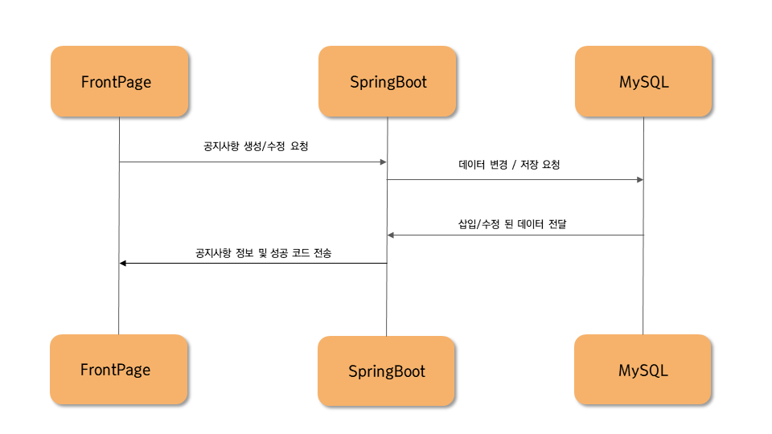

### 7-4. 공지사항 삭제

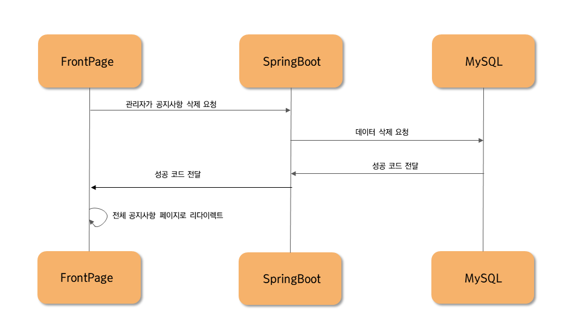

## 8. 검색

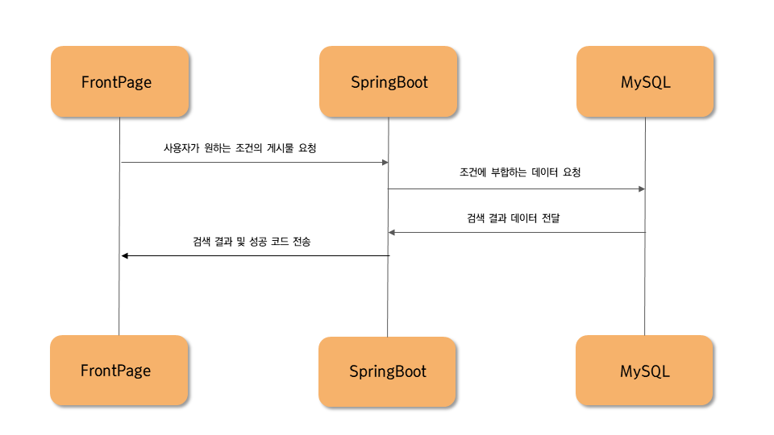

## 9. 랭킹

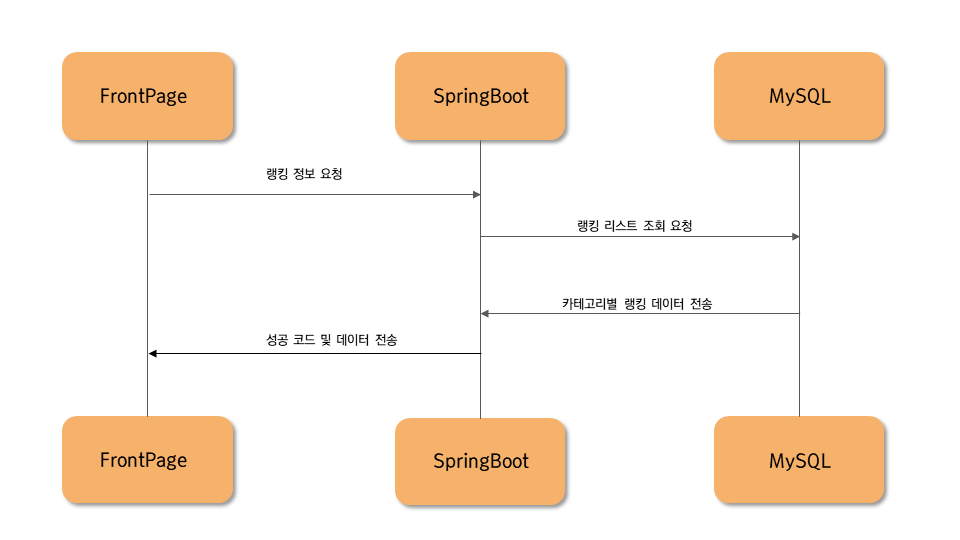

## 10. 채팅

## 11. 에러

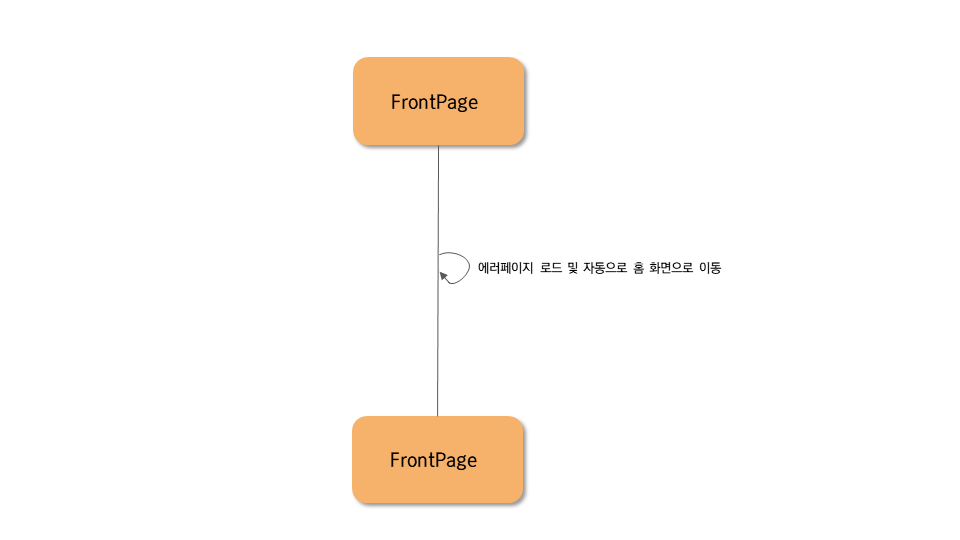
